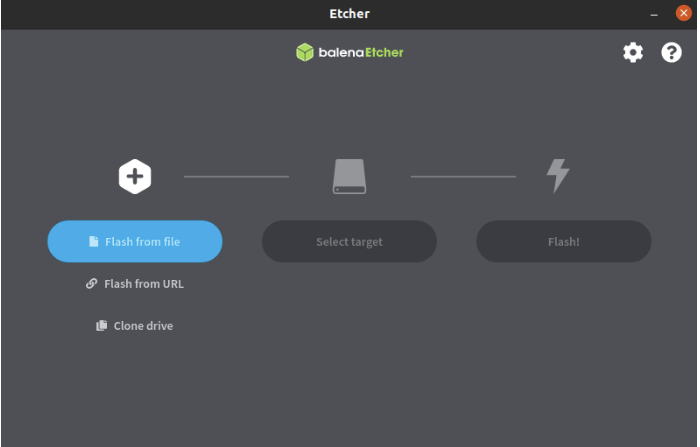

# 安装镜像到M.2 NVME SSD

## 带 NVME 转 USB3.0 读卡器 或 带 NVME 插槽的 PC主机

1. 准备

- ROCK 5B板
- 良好的电源适配器
- M.2 NVME SSD
- **NVME 转 USB3.0 读卡器 或 带 NVME 插槽的 PC主机**

2. 下载必要的工具和镜像

Etcher就是我们用来写镜像的工具。 从 ROCK 5 [下载](https://wiki.radxa.com/Rock5/downloads)页面为您的 PC 下载合适的 Etcher 并安装它。 

查看 [Etcher 网站](https://www.balena.io/etcher)以获取有关 Etcher 的更多信息。

从 ROCK 5B [下载](https://wiki.radxa.com/Rock5/downloads)页面选择您要安装的映像。
这里我们使用下图进行书写。
```
rock-5b-debian-bullseye-xfce4-arm64-20220906-0626-gpt.img.xz
```

3. 将映像写入 M.2 NVME SSD

将 M.2 NVME SSD 插入 M.2 NVME SSD 转 USB3.0 读卡器，连接主机。

运行应用程序。 例如在 Ubuntu 20.04 上双击 balenaEtcher-1.5.116-x64.AppImage：

在etcher窗口中，我们单击“Flash from File”按钮。


在etcher窗口中，我们单击“Select Target”按钮。


在etcher窗口中，我们单击“Flash”按钮。


在etcher窗口中，会显示Flash Complete


完毕！ 现在您已成功在 M.2 NVME SSD 上安装操作系统映像。

## 在ROCK 5B上写入NVMe SSD

1. 按照[烧录方式](../basic/flash)和[入门教程](../basic/getting_started)烧录镜像到eMMC 模块和 Micro SD card

2. 将NVMe SSD装入ROCK 5B， 插入带有镜像的eMMC模块和Micro SD card。上电启动。

3. 将下载ROCK 5B镜像到 ROCK5B中。可以通过SCP命令等工具。查看[入门教程](../basic/getting_started)

4. 检查NVMe SSD是否存在
```
sudo fdisk -l
```
    你可以看到以下类似信息：
```
Disk /dev/nvme0n1: 232.9 GiB, 250059350016 bytes, 488397168 sectors             
    #The '/dev/nvme0n1' is your NVME SSD device path
Units: sectors of 1 * 512 = 512 bytes                                           
Sector size (logical/physical): 512 bytes / 512 bytes                           
I/O size (minimum/optimal): 512 bytes / 512 bytes 
```

5. 在ROCK 5B烧录到NVMe SSD中
```
sudo sudo xzcat 'your compressed image path' | dd of='your NVME SSD device path' bs=1M status=progress            
#such as: sudo xzcat rock-5b-debian-bullseye-xfce4-arm64-20220906-0626-gpt.img.xz  | dd of=/dev/nvme0n1 bs=1M status=progress
```

## 擦除 M.2 NVMe SSD

之前M.2 NVMe SSD是用Android（或Linux）image写的，现在改成Linux（或Android）。 建议您先擦除 M.2 NVMe SSD。 然后写入目标image。

## 从NVMe SSD启动

将映像写入 NVMe SSD 后，要从 NVMe SSD 启动，您需要将bootloader写入 SPI Flash。
请看[安装bootloader到SPI Flash](./bloader_spi_flash)