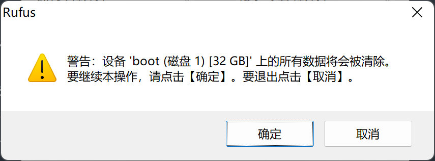
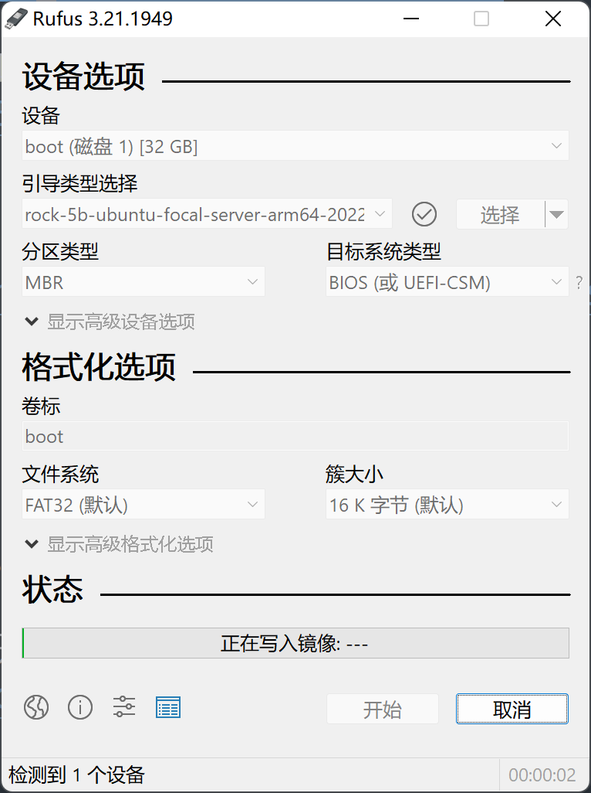

# 烧录方式选择

## Etcher 方式

- 该方法适用于 Windows、MacOS、Linux x64 操作系统

1. 从 [balena 官网](https://www.balena.io/etcher/) 下载 balenaEtcher ，选择指定主机系统下载。该处Linux的程序格式是AppImage，某些用户可能需要通过chmod命令修改成***可执行***运行即可。

2. 将要烧录的MicroSD Card插入MicroSD Card读卡器，或者eMMC 按照正确方式插入 eMMC 读卡器。 eMMC的正确插入方式请看:

.

3. 打开etcher窗口，首先选择Flash from file，找到您镜像下载位置，双击选择。


4. 然后点击Select target，选择自己要烧录的eMMC或者MicroSD Card。


5. 点击Flash,烧录等待成功，这里需要一段时间。


6. 烧录成功，会显示如图所示，Flash Complete！，如果烧录未成功，请麻烦重试。


## Rufus方式

- 该方式适合 Windows。

1. 从 [Rufus](https://rufus.ie/zh/) 下载 Rufus。

2. 插入已经装好MicroSD卡或者eMMC的读卡器，然后打开Rufus，Rufus会自动识别，如果识别错误，请在设备栏目选中正确读卡器。显示如图所示。
- 

3. 点击选择，选中下载好的镜像，如图所示。
- 
- 

4. 点击开始之后，会提示警告信息，点击确定。
- 

5. 等待烧录完成，进度条走完即烧录完成。
- 
- 


## dd命令方式

该方式适合 Linux系统

1. 使用```sudo fdisk -l```命令查看存储卡，如图所示

- 
- 可以看出，MicroSD Card的盘符: /dev/sdb

2. 如果有显示有分区，并且有挂载目录，需要提前取消挂载，使用```umount```命令取消挂载。

3. 写入镜像前，请解压下载的镜像文件为```.img```文件。使用```xz```命令解压缩。如图所示：
```xz -d 镜像压缩名称```
- 

4. dd命令格式```sudo dd if=镜像位置 of=/dev/盘号```，如图所示：

- 
- if 后面接的是想要烧录的镜像，of 指向烧录位置，可以是设备或者文件，bs指块大小，status 为显示烧录状态，oflag表示dd方式，这里选择直连（即不复制到内存中），等到终端自行退出到可输入模式后就已经完成烧录了。
