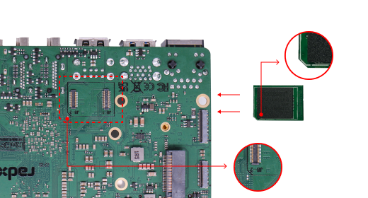

# ROCK5B 入门

## 入门准备

- ROCK5B 主板

- 以下大容量存储卡之一：
	* microSD， 大于 8GB
	* eMMC Module， 大于8GB
	* 推荐使用 Radxa eMMC Module .

- 电源供应
	* ROCK 5B采用Type-C接口供电，输入电压范围广，从5V到21V。 
	* ROCK 5B 支持 9V/2A、12V/2A、15V/2A 和 20V/2A 的 USB Type-C PD 2.0。
	* 您使用的Type-C数据线需要支持数据通信。 我们称之为USB Type-C充电数据线。
	* 推荐使用官方的 Radxa Power PD 30W .

- USB 键盘和鼠标
	* ROCK 5B 配备四个 USB-A 接口，可配备全尺寸键盘和鼠标。

- 显示器 和 HDMI线
	* ROCK 5B 配备全尺寸 HDMI 接口。 建议使用支持 HDMI 的显示器。
	* HDMI EDID用于确定最佳显示分辨率。 在支持 1080p（或 4K/8K）的显示器和电视上，将选择此分辨率。 如果不支持 1080p，EDID会找到的下一个可用分辨率。 此选定模式适用于大多数显示器/电视，但不适用于所有显示器/电视。

- USB 转 TTL串口线
	* ROCK 5B 为 CPU 输出一个专用串行控制台，可以访问低级调试消息。
	* 推荐使用Radxa USB to TTL Cable .

- 读卡器（二选一）
	* microSD 读卡器: 用于将镜像烧录到 microSD 卡中
	* eMMC 读卡器: 用于将镜像烧录到eMMC 模块中，推荐使用 Radxa eMMC USB3 reader .

## 可选选项

- USB A 型转 C 型电缆
	* 如果您想从 USB OTG 端口在 ROCK 5B 上写入镜像或使用 fastboot/adb 命令，您需要 USB typec A 到 type C 电缆连接 ROCK 5B 和 PC。

- Ethernet 线（网线）
	* ROCK 5B 支持以太网上网。
	* 网线用于将 ROCK 5B 连接到本地网络和互联网。

- 相机模块
	* ROCK 5B支持拍照功能。
	* 推荐使用 [Radxa Camera 4K](../../../accessories/camera_4k).

- LCD显示屏
	* ROCK 5B支持LCD显示功能。
	* 推荐使用 [Radxa Display 8 HD](../../../accessories/display_8hd).

- 音频线
	* 可以使用标准 3.5 毫米插孔通过扬声器或耳机播放音频。

- WiFi/蓝牙卡
	* ROCK5B 支持 市面上常见的无线模块，请查看[支持列表](../accessories/support_accessories)的 Wireless 列表。
	* 推荐使用 Radxa Wireless Module A8 
	.

## 第一次启动板子

- ROCK 5B 可以使用 eMMC Module 或 μSD Card（MicroSD Card） 启动。 

### 准备

- 使用 eMMC Module 启动系统时

	* （选项 a）将 eMMC 模块插入 eMMC USB 读卡器。 然后将 ROCK Pi eMMC USB 读卡器插入主机 PC。
	* （选项 b）将 eMMC 模块插入 eMMC 到 μSD 卡转换板。 将转换板插入 μSD 读卡器。 然后将读卡器插入主机 PC。

- 使用 μSD 卡启动系统时

	* （选项 c）将 μSD 卡插入 μSD 读卡器。 然后将读卡器插入主机 PC。

- 从 [下载](https://wiki.radxa.com/Rock5/downloads) 中下载官方 Ubuntu/Debian 系统镜像。

### 首次烧录

- [烧录方式选择](./flash).

### 启动板子

- 现在将带有镜像的存储介质 μSD Card 或 eMMC Module 插入开发板上的插槽中。

- μSD Card插入方式，如图所示：
- 

- eMMC Module 插入方式，找到缺口的位置，对准按压即可。如图所示: 
- 

- （可选）使用 USB 转 TTL 串口线, 请参加下面串口访问。

- 通过带有 USB type C 端口的适配器为 ROCK 5B 供电。

- ROCK 5B 将在绿色电源 LED 亮起的情况下启动。 过了一会儿，另一个蓝色 LED 开始闪烁。

### 访问 ROCK5B

- 默认用户密码
```
User Name : rock
Password  : rock
```
- 切换到 root 用户
```
rock@rock-5b:~$ 
rock@rock-5b:~$ sudo su
[sudo] password for rock: 
root@rock-5b:/home/rock# 
```
- root 用户默认没有密码。 您可以通过“passwd root”设置密码。
```
root@rock-5b:/home/rock# passwd root
New password: 
Retype new password: 
passwd: password updated successfully
root@rock-5b:/home/rock#
```

#### HDMI 显示器和鼠标键盘

- 如图所示，插入HDMI线材和鼠标键盘


#### 串口访问

- [串口访问](./usb_ttl_cable)

#### SSH访问

- [SSH访问](./ssh_access)

### 文件传输

#### SCP

scp 命令格式

- 选项: 常用-r传输文件夹
- 源地址: 文件在主机的位置。
- 目标地址: 需要上传到ROCK5B的位置。
- 用户名： ROCK5B的用户名，默认: rock。
- IP地址: 此处为ROCK5B的IP地址，请根据实际情况填写。
- 
```
scp 选项   源地址  用户名@IP地址:目标地址
```
**注意: 关于更多关于scp的命令，请参考man手册

#### Filezilla

- 整体布局
- 
- 输入ROCK5B的ip地址，用户名，密码，端口号22，点击快速链接。选中保存密码，确定之后。再点击总是信任该主机，如图所示。
- 首先你的ROCK5B文件栏需要调整到你的目标位置，然后在主机PC文件栏选中你需要上传的文件，右键点击上传，等待完成即可。

### 以太网连接

- 查看网络配置
```
sudo ifconfig
```
- 测试网络
```
ping -c 5 www.google.com
```

###  WIFI&BT 连接

- [WIFI_BT 支持和使用教程](../accessories/wifi_bt_access).

### LED 状态

ROCK 5B 具有电源 LED 和用户 LED。

- 电源指示灯
电源 LED 为绿色。 ROCK 5B默认通电时常亮，

- 用户指示灯
用户 LED 为蓝色。 默认情况下，其闪烁状态显示正在运行的内核。

### GPIO 功能描述

ROCK 5B 有 1 个 40 针扩展接头。 每个管脚以颜色区分，更多信息请点击 [ROCK5B GPIO](./rock5b_gpio).

GPIO 的开发。 ROCK 5B 支持 libmraa GPIO 库，点击[这里](https://wiki.radxa.com/Rock5/dev/libmraa)获取更多信息。

### 关机与重启

- 立刻关机
```
sudo shutdown -h now
```
- 重启命令
```
sudo reboot
```
